State and national presidential election forecasting model
================
Last update on Wednesday June 10, 2020 at 09:51 AM EDT

Code for a dynamic multi-level Bayesian model to predict US presidential
elections, implemented in Stan.

Improving on Pierre Kremp’s
[implementation](http://www.slate.com/features/pkremp_forecast/report.html)
of Drew Linzer’s dynamic linear model for election forecasting
[(Linzer 2013)](https://votamatic.org/wp-content/uploads/2013/07/Linzer-JASA13.pdf),
we (1) add corrections for partisan non-response, survey mode and survey
population; (2) use informative state-level priors that update
throughout the election year; and (3) specify empirical state-level
correlations from political and demographic variables.

## Model performance

Overall:

Select an election for
more:

### 2008

#### Map

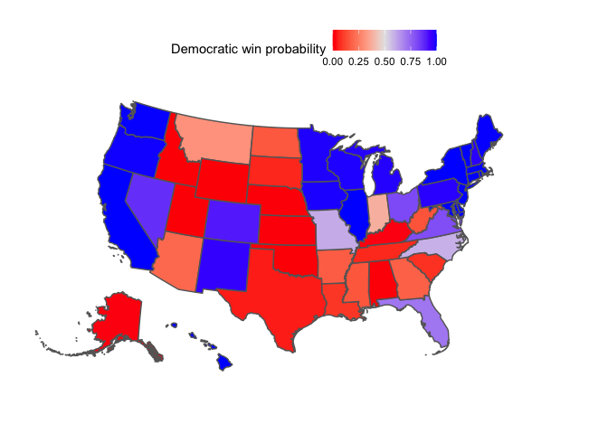<!-- -->

#### Final electoral college histogram

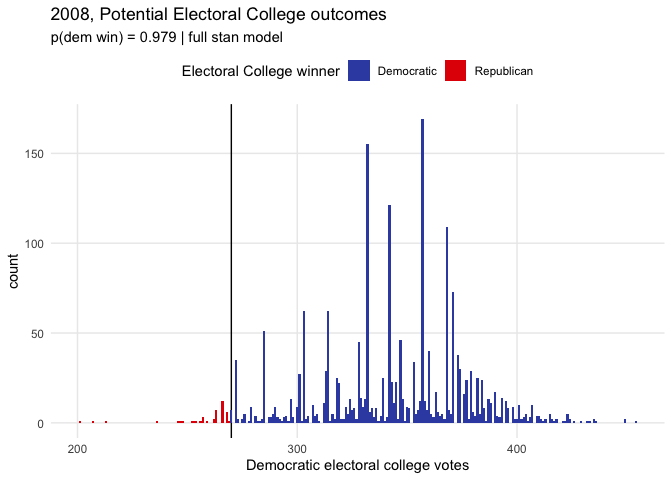<!-- -->

#### National and state polls and the electoral college over time

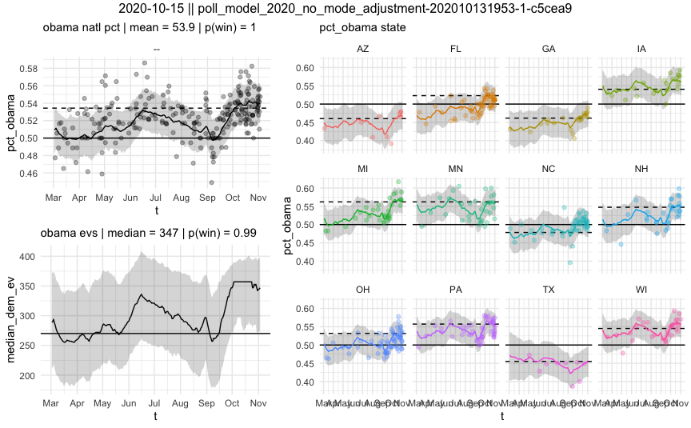<!-- -->

#### State vs national deltas over time

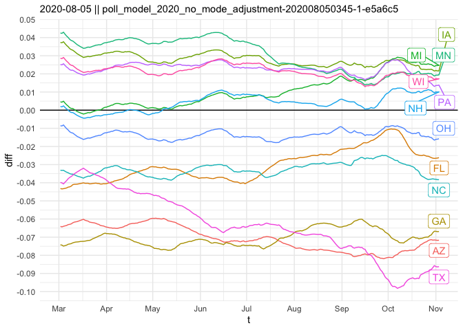<!-- -->

#### Model results vs polls vs the prior

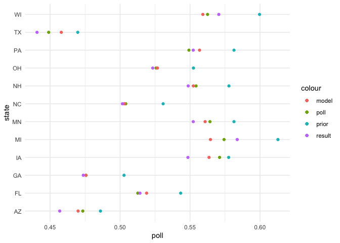<!-- -->

#### Performance

| outlet               | ev\_wtd\_brier | unwtd\_brier | states\_correct |
| :------------------- | -------------: | -----------: | --------------: |
| economist (backtest) |      0.0299813 |     0.027283 |              49 |

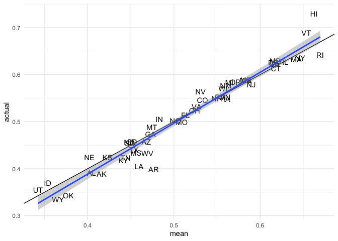<!-- -->

    ## [1] 0.02215926

#### Predictions for each state

| state |  mean |   low |  high |  prob |    se |
| :---- | ----: | ----: | ----: | ----: | ----: |
| NC    | 0.507 | 0.459 | 0.556 | 0.590 | 0.029 |
| MO    | 0.508 | 0.460 | 0.555 | 0.601 | 0.028 |
| IN    | 0.490 | 0.439 | 0.539 | 0.379 | 0.029 |
| MT    | 0.485 | 0.434 | 0.534 | 0.303 | 0.029 |
| FL    | 0.516 | 0.467 | 0.566 | 0.713 | 0.030 |
| OH    | 0.525 | 0.479 | 0.572 | 0.810 | 0.028 |
| AZ    | 0.475 | 0.428 | 0.523 | 0.200 | 0.029 |
| GA    | 0.474 | 0.426 | 0.522 | 0.179 | 0.029 |
| VA    | 0.527 | 0.474 | 0.575 | 0.800 | 0.029 |
| AR    | 0.470 | 0.420 | 0.520 | 0.171 | 0.030 |
| MS    | 0.469 | 0.417 | 0.521 | 0.154 | 0.031 |
| WV    | 0.468 | 0.419 | 0.519 | 0.149 | 0.030 |
| ND    | 0.468 | 0.413 | 0.523 | 0.160 | 0.033 |
| NV    | 0.534 | 0.485 | 0.583 | 0.868 | 0.029 |
| CO    | 0.538 | 0.491 | 0.583 | 0.908 | 0.027 |
| –     | 0.541 | 0.509 | 0.571 | 0.988 | 0.018 |
| LA    | 0.458 | 0.409 | 0.510 | 0.086 | 0.031 |
| SC    | 0.456 | 0.409 | 0.508 | 0.077 | 0.031 |
| SD    | 0.454 | 0.405 | 0.502 | 0.058 | 0.028 |
| TX    | 0.449 | 0.401 | 0.497 | 0.042 | 0.028 |
| TN    | 0.448 | 0.397 | 0.504 | 0.060 | 0.033 |
| NH    | 0.556 | 0.508 | 0.603 | 0.972 | 0.028 |
| PA    | 0.556 | 0.508 | 0.603 | 0.973 | 0.028 |
| NM    | 0.559 | 0.503 | 0.611 | 0.959 | 0.031 |
| KY    | 0.439 | 0.391 | 0.489 | 0.021 | 0.030 |
| MN    | 0.561 | 0.512 | 0.610 | 0.983 | 0.029 |
| MI    | 0.562 | 0.514 | 0.607 | 0.978 | 0.027 |
| WI    | 0.563 | 0.515 | 0.612 | 0.985 | 0.029 |
| IA    | 0.563 | 0.513 | 0.610 | 0.987 | 0.028 |
| AK    | 0.436 | 0.387 | 0.485 | 0.018 | 0.029 |
| KS    | 0.425 | 0.378 | 0.475 | 0.009 | 0.030 |
| OR    | 0.577 | 0.529 | 0.624 | 0.994 | 0.028 |
| NE    | 0.417 | 0.369 | 0.467 | 0.002 | 0.030 |
| WA    | 0.585 | 0.537 | 0.632 | 0.998 | 0.028 |
| ME    | 0.588 | 0.540 | 0.635 | 0.998 | 0.028 |
| NJ    | 0.596 | 0.545 | 0.644 | 0.999 | 0.028 |
| AL    | 0.402 | 0.353 | 0.451 | 0.004 | 0.029 |
| DE    | 0.619 | 0.571 | 0.664 | 1.000 | 0.027 |
| CA    | 0.622 | 0.577 | 0.665 | 1.000 | 0.025 |
| WY    | 0.378 | 0.330 | 0.430 | 0.000 | 0.031 |
| CT    | 0.623 | 0.574 | 0.670 | 1.000 | 0.028 |
| OK    | 0.377 | 0.329 | 0.427 | 0.000 | 0.030 |
| MD    | 0.628 | 0.572 | 0.679 | 1.000 | 0.030 |
| IL    | 0.628 | 0.580 | 0.675 | 1.000 | 0.028 |
| MA    | 0.635 | 0.584 | 0.687 | 1.000 | 0.031 |
| ID    | 0.353 | 0.307 | 0.403 | 0.000 | 0.030 |
| NY    | 0.650 | 0.602 | 0.695 | 1.000 | 0.027 |
| UT    | 0.346 | 0.297 | 0.397 | 0.000 | 0.031 |
| VT    | 0.663 | 0.614 | 0.709 | 1.000 | 0.027 |
| RI    | 0.665 | 0.612 | 0.712 | 1.000 | 0.028 |
| HI    | 0.681 | 0.624 | 0.731 | 1.000 | 0.030 |
| DC    | 0.885 | 0.852 | 0.914 | 1.000 | 0.017 |

### 2012

#### Map

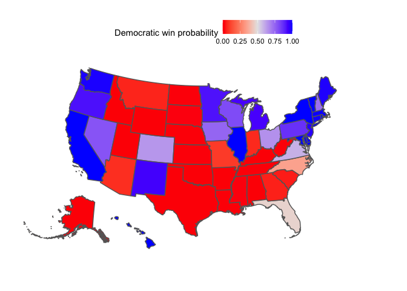<!-- -->

#### Final electoral college histogram

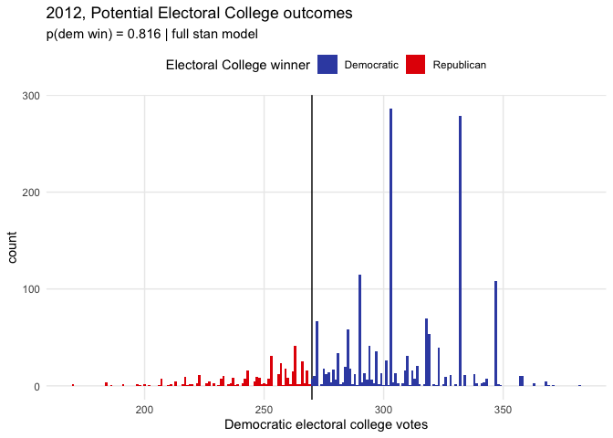<!-- -->

#### National and state polls and the electoral college over time

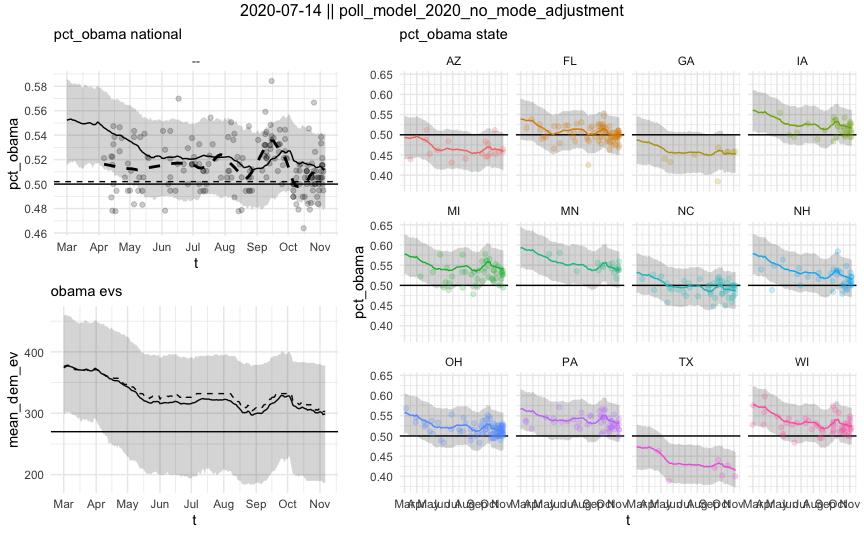<!-- -->

#### State vs national deltas over time

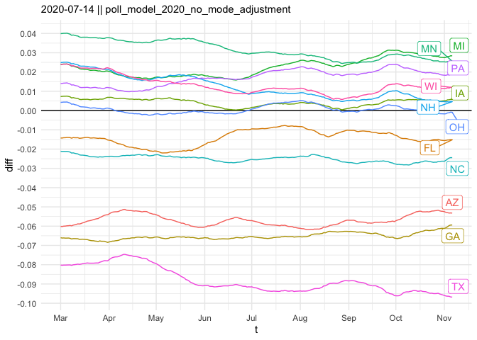<!-- -->

#### Model results vs polls vs the prior

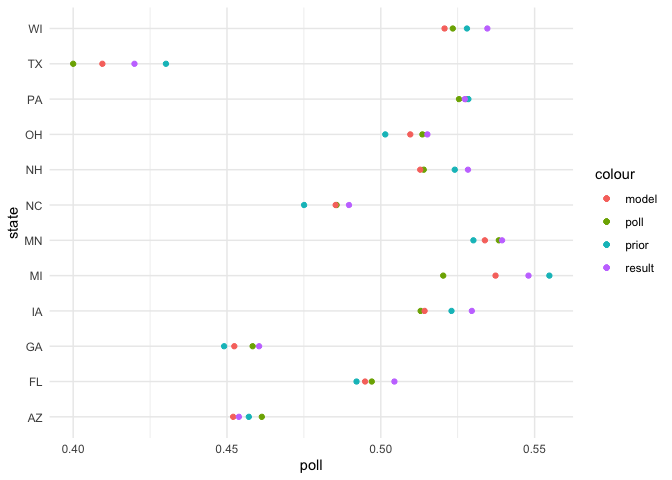<!-- -->

#### Performance

| outlet                | ev\_wtd\_brier | unwtd\_brier | states\_correct |
| :-------------------- | -------------: | -----------: | --------------: |
| Linzer                |             NA |    0.0038000 |              NA |
| Wang/Ferguson         |             NA |    0.0076100 |              NA |
| Silver/538            |             NA |    0.0091100 |              NA |
| Jackman/Pollster      |             NA |    0.0097100 |              NA |
| Desart/Holbrook       |             NA |    0.0160500 |              NA |
| economist (backtest)  |      0.0367655 |    0.0244765 |              50 |
| Intrade               |             NA |    0.0281200 |              NA |
| Enten/Margin of Error |             NA |    0.0507500 |              NA |

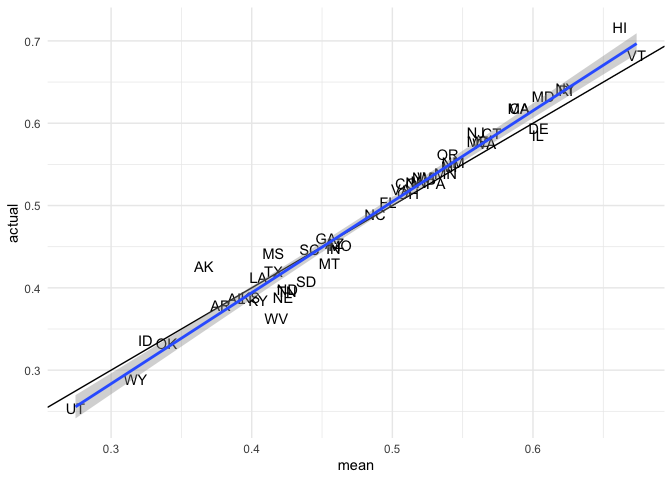<!-- -->

    ## [1] 0.02259156

#### Predictions for each state

| state |  mean |   low |  high |  prob |    se |
| :---- | ----: | ----: | ----: | ----: | ----: |
| FL    | 0.496 | 0.451 | 0.541 | 0.450 | 0.027 |
| VA    | 0.505 | 0.460 | 0.552 | 0.574 | 0.028 |
| OH    | 0.507 | 0.461 | 0.554 | 0.605 | 0.028 |
| CO    | 0.508 | 0.462 | 0.555 | 0.605 | 0.028 |
| NC    | 0.489 | 0.443 | 0.535 | 0.346 | 0.027 |
| –     | 0.513 | 0.483 | 0.548 | 0.761 | 0.021 |
| NH    | 0.516 | 0.471 | 0.560 | 0.717 | 0.026 |
| IA    | 0.517 | 0.473 | 0.563 | 0.730 | 0.027 |
| NV    | 0.520 | 0.472 | 0.565 | 0.749 | 0.027 |
| PA    | 0.526 | 0.480 | 0.572 | 0.815 | 0.027 |
| WI    | 0.526 | 0.481 | 0.571 | 0.822 | 0.027 |
| MN    | 0.535 | 0.489 | 0.582 | 0.888 | 0.028 |
| MI    | 0.537 | 0.492 | 0.581 | 0.911 | 0.026 |
| OR    | 0.541 | 0.496 | 0.590 | 0.924 | 0.029 |
| MO    | 0.458 | 0.414 | 0.505 | 0.070 | 0.028 |
| IN    | 0.458 | 0.413 | 0.504 | 0.068 | 0.027 |
| NM    | 0.544 | 0.500 | 0.589 | 0.946 | 0.026 |
| MT    | 0.454 | 0.409 | 0.502 | 0.056 | 0.029 |
| AZ    | 0.454 | 0.407 | 0.501 | 0.056 | 0.028 |
| GA    | 0.449 | 0.404 | 0.495 | 0.035 | 0.027 |
| SC    | 0.441 | 0.386 | 0.499 | 0.046 | 0.034 |
| NJ    | 0.562 | 0.516 | 0.608 | 0.991 | 0.028 |
| ME    | 0.564 | 0.517 | 0.609 | 0.992 | 0.027 |
| SD    | 0.435 | 0.389 | 0.484 | 0.016 | 0.029 |
| WA    | 0.567 | 0.522 | 0.613 | 0.993 | 0.028 |
| CT    | 0.570 | 0.527 | 0.616 | 0.992 | 0.027 |
| TN    | 0.428 | 0.383 | 0.475 | 0.005 | 0.028 |
| ND    | 0.424 | 0.381 | 0.471 | 0.004 | 0.028 |
| NE    | 0.423 | 0.377 | 0.469 | 0.004 | 0.028 |
| WV    | 0.417 | 0.365 | 0.470 | 0.004 | 0.031 |
| TX    | 0.410 | 0.364 | 0.453 | 0.000 | 0.026 |
| CA    | 0.591 | 0.549 | 0.635 | 1.000 | 0.026 |
| KY    | 0.406 | 0.357 | 0.458 | 0.002 | 0.031 |
| KS    | 0.405 | 0.346 | 0.469 | 0.011 | 0.038 |
| LA    | 0.403 | 0.356 | 0.451 | 0.002 | 0.028 |
| MS    | 0.403 | 0.330 | 0.474 | 0.016 | 0.043 |
| IL    | 0.598 | 0.552 | 0.643 | 1.000 | 0.027 |
| MA    | 0.600 | 0.553 | 0.645 | 1.000 | 0.027 |
| DE    | 0.601 | 0.545 | 0.653 | 0.997 | 0.031 |
| MD    | 0.609 | 0.558 | 0.655 | 1.000 | 0.027 |
| AL    | 0.389 | 0.338 | 0.442 | 0.002 | 0.031 |
| AK    | 0.380 | 0.318 | 0.445 | 0.002 | 0.038 |
| RI    | 0.622 | 0.574 | 0.669 | 1.000 | 0.028 |
| NY    | 0.623 | 0.580 | 0.670 | 1.000 | 0.028 |
| AR    | 0.369 | 0.324 | 0.418 | 0.000 | 0.029 |
| WY    | 0.348 | 0.274 | 0.430 | 0.004 | 0.049 |
| OK    | 0.343 | 0.292 | 0.399 | 0.000 | 0.034 |
| HI    | 0.660 | 0.614 | 0.704 | 1.000 | 0.026 |
| ID    | 0.332 | 0.286 | 0.383 | 0.000 | 0.031 |
| VT    | 0.674 | 0.626 | 0.721 | 1.000 | 0.028 |
| UT    | 0.276 | 0.230 | 0.328 | 0.000 | 0.031 |
| DC    | 0.819 | 0.650 | 0.931 | 0.996 | 0.067 |

### 2016

#### Map

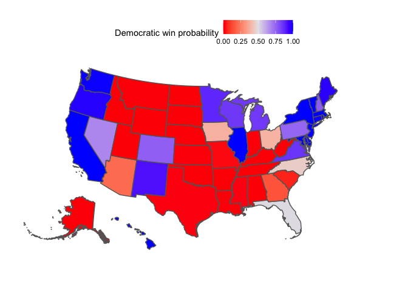<!-- -->

#### Final electoral college histogram

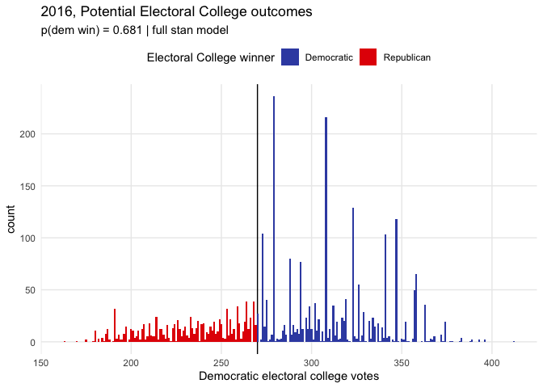<!-- -->

#### National and state polls and the electoral college over time

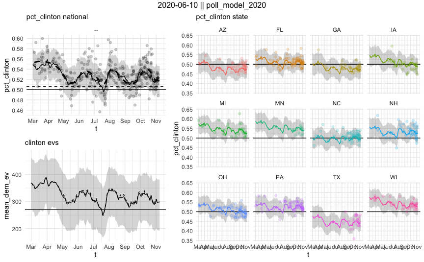<!-- -->

#### State vs national deltas over time

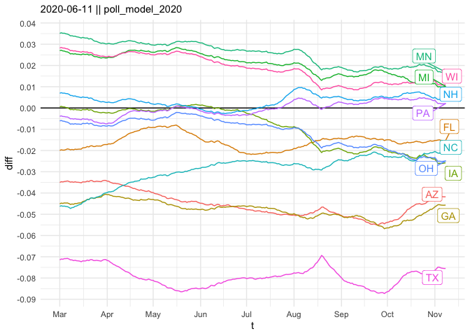<!-- -->

#### Model results vs polls vs the prior

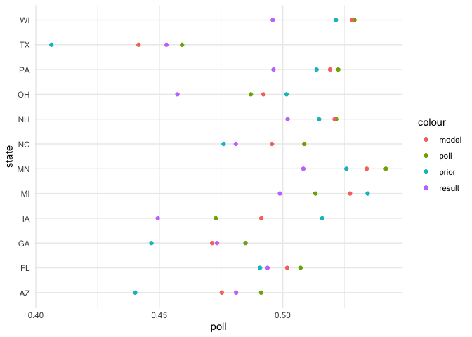<!-- -->

#### Performance

| outlet               | ev\_wtd\_brier | unwtd\_brier | states\_correct |
| :------------------- | -------------: | -----------: | --------------: |
| economist (backtest) |      0.0812538 |    0.0560511 |              47 |
| 538 polls-plus       |      0.0928000 |    0.0664000 |              46 |
| 538 polls-only       |      0.0936000 |    0.0672000 |              46 |
| princeton            |      0.1169000 |    0.0744000 |              47 |
| nyt upshot           |      0.1208000 |    0.0801000 |              46 |
| kremp/slate          |      0.1210000 |    0.0766000 |              46 |
| pollsavvy            |      0.1219000 |    0.0794000 |              46 |
| predictwise markets  |      0.1272000 |    0.0767000 |              46 |
| predictwise overall  |      0.1276000 |    0.0783000 |              46 |
| desart and holbrook  |      0.1279000 |    0.0825000 |              44 |
| daily kos            |      0.1439000 |    0.0864000 |              46 |
| huffpost             |      0.1505000 |    0.0892000 |              46 |

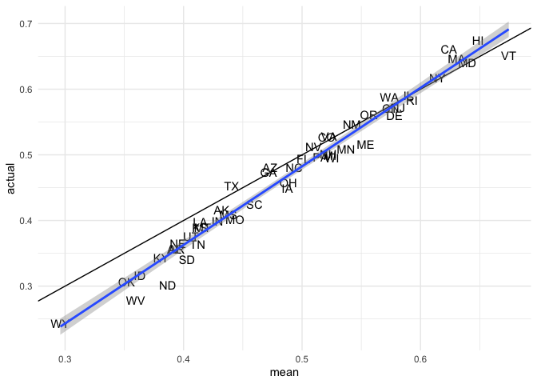<!-- -->

    ## [1] 0.03175271

#### Predictions for each state

| state |  mean |   low |  high |  prob |    se |
| :---- | ----: | ----: | ----: | ----: | ----: |
| FL    | 0.501 | 0.454 | 0.547 | 0.524 | 0.028 |
| NC    | 0.493 | 0.449 | 0.539 | 0.402 | 0.027 |
| NV    | 0.510 | 0.464 | 0.556 | 0.629 | 0.027 |
| OH    | 0.488 | 0.445 | 0.531 | 0.331 | 0.026 |
| IA    | 0.488 | 0.443 | 0.533 | 0.316 | 0.027 |
| PA    | 0.516 | 0.472 | 0.559 | 0.719 | 0.026 |
| –     | 0.517 | 0.491 | 0.546 | 0.823 | 0.018 |
| CO    | 0.521 | 0.477 | 0.566 | 0.787 | 0.027 |
| NH    | 0.522 | 0.478 | 0.567 | 0.805 | 0.027 |
| VA    | 0.523 | 0.481 | 0.562 | 0.812 | 0.023 |
| MI    | 0.524 | 0.480 | 0.567 | 0.818 | 0.026 |
| WI    | 0.525 | 0.482 | 0.568 | 0.839 | 0.025 |
| AZ    | 0.473 | 0.428 | 0.519 | 0.151 | 0.027 |
| GA    | 0.472 | 0.425 | 0.518 | 0.168 | 0.027 |
| MN    | 0.537 | 0.495 | 0.580 | 0.922 | 0.026 |
| SC    | 0.460 | 0.418 | 0.504 | 0.066 | 0.026 |
| NM    | 0.542 | 0.496 | 0.588 | 0.931 | 0.027 |
| ME    | 0.554 | 0.512 | 0.597 | 0.977 | 0.026 |
| OR    | 0.556 | 0.512 | 0.599 | 0.980 | 0.025 |
| MO    | 0.443 | 0.402 | 0.488 | 0.024 | 0.026 |
| TX    | 0.441 | 0.400 | 0.483 | 0.016 | 0.025 |
| MS    | 0.438 | 0.391 | 0.487 | 0.017 | 0.029 |
| AK    | 0.432 | 0.387 | 0.477 | 0.015 | 0.027 |
| IN    | 0.429 | 0.386 | 0.474 | 0.009 | 0.027 |
| CT    | 0.574 | 0.531 | 0.620 | 0.996 | 0.027 |
| WA    | 0.574 | 0.530 | 0.618 | 0.998 | 0.027 |
| DE    | 0.578 | 0.536 | 0.622 | 0.997 | 0.026 |
| NJ    | 0.581 | 0.538 | 0.626 | 0.999 | 0.027 |
| MT    | 0.416 | 0.370 | 0.464 | 0.004 | 0.028 |
| LA    | 0.414 | 0.367 | 0.459 | 0.002 | 0.027 |
| KS    | 0.414 | 0.372 | 0.461 | 0.003 | 0.028 |
| TN    | 0.412 | 0.369 | 0.456 | 0.003 | 0.026 |
| IL    | 0.590 | 0.547 | 0.634 | 0.999 | 0.026 |
| RI    | 0.593 | 0.549 | 0.639 | 1.000 | 0.028 |
| UT    | 0.406 | 0.355 | 0.459 | 0.002 | 0.031 |
| SD    | 0.403 | 0.359 | 0.450 | 0.001 | 0.028 |
| NE    | 0.395 | 0.353 | 0.439 | 0.000 | 0.026 |
| AR    | 0.394 | 0.349 | 0.441 | 0.001 | 0.028 |
| AL    | 0.392 | 0.349 | 0.437 | 0.000 | 0.027 |
| ND    | 0.387 | 0.344 | 0.433 | 0.000 | 0.028 |
| NY    | 0.614 | 0.572 | 0.657 | 1.000 | 0.026 |
| KY    | 0.381 | 0.340 | 0.426 | 0.000 | 0.027 |
| CA    | 0.624 | 0.583 | 0.664 | 1.000 | 0.024 |
| MA    | 0.630 | 0.589 | 0.675 | 1.000 | 0.026 |
| ID    | 0.363 | 0.322 | 0.407 | 0.000 | 0.026 |
| MD    | 0.639 | 0.596 | 0.682 | 0.999 | 0.025 |
| WV    | 0.360 | 0.317 | 0.403 | 0.000 | 0.026 |
| OK    | 0.352 | 0.307 | 0.401 | 0.000 | 0.029 |
| HI    | 0.649 | 0.602 | 0.694 | 1.000 | 0.027 |
| VT    | 0.674 | 0.630 | 0.717 | 1.000 | 0.025 |
| WY    | 0.296 | 0.257 | 0.340 | 0.000 | 0.026 |
| DC    | 0.833 | 0.705 | 0.929 | 0.999 | 0.057 |

## Cumulative charts

### Calibration plot

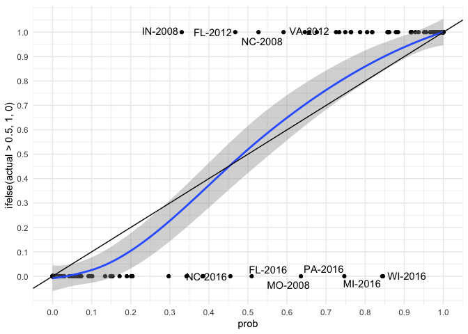<!-- -->
