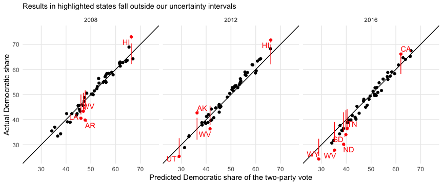
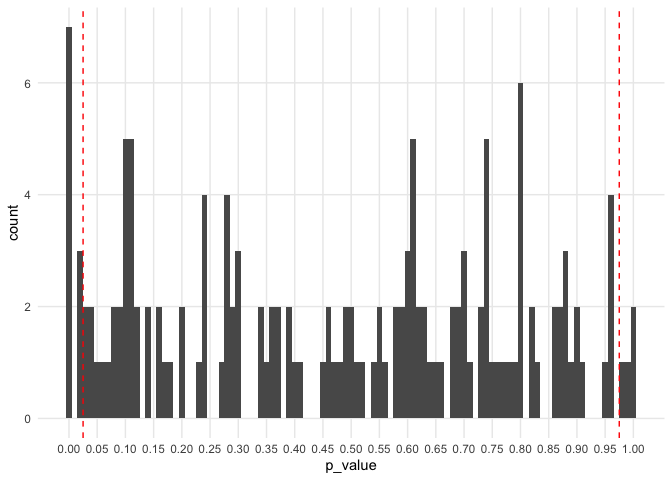

State and national presidential election forecasting model
================
Last update on Thursday October 15, 2020 at 12:29 PM EDT

Code for a dynamic multilevel Bayesian model to predict US presidential
elections. Written in R and Stan.

Improving on Pierre Kremp’s
[implementation](http://www.slate.com/features/pkremp_forecast/report.html)
of Drew Linzer’s dynamic linear model for election forecasting
[(Linzer 2013)](https://votamatic.org/wp-content/uploads/2013/07/Linzer-JASA13.pdf),
we (1) add corrections for partisan non-response, survey mode and survey
population; (2) use informative state-level priors that update
throughout the election year; and (3) specify empirical state-level
correlations from political and demographic variables.

You can see the model’s predictions for 2020
[here](https://projects.economist.com/us-2020-forecast/president) and
read how it works
[here](https://projects.economist.com/us-2020-forecast/president/how-this-works).

## File dictionary

In terms of useful files, you should pay attention to the 3 scripts for
the 2008, 2012 and 2016 US presidential elections are located in the
`scripts/model` directory. There are three R scripts that import data,
run models and parse results:

  - `final_model_2008.R`
  - `final_model_2012.R`
  - `final_model_2016.R`

And there are 3 different Stan scripts that will run different versions
of our polling aggregate and election forecasting model:

  - `poll_model_2020.stan` - the final model we use for the 2020
    presidential election
  - `poll_model_2020_no_mode_adjustment.stan` - a model that removes the
    correction for partisan non-response bias in the polls and the
    adjustments for the mode in which a survey is conducted (live phone,
    online, other) and its population (adult, likely voter, registered
    voter)

## Model performance

Here is a graphical summary of the model’s performance in 2008, 2012 and
2016.

### 2008

#### Map

<!-- -->

#### Final electoral college histogram

<!-- -->

#### National and state polls and the electoral college over time

<!-- -->

#### State vs national deltas over time

<!-- -->

#### Model results vs polls vs the prior

<!-- -->

#### Performance

| outlet               | ev\_wtd\_brier | unwtd\_brier | states\_correct |
| :------------------- | -------------: | -----------: | --------------: |
| economist (backtest) |      0.0321964 |    0.0289902 |              49 |

<!-- -->

    ## [1] 0.02318035

#### Predictions for each state

| state |  mean |   low |  high |  prob |    se |
| :---- | ----: | ----: | ----: | ----: | ----: |
| NC    | 0.502 | 0.466 | 0.538 | 0.545 | 0.021 |
| MO    | 0.509 | 0.474 | 0.543 | 0.704 | 0.020 |
| FL    | 0.514 | 0.479 | 0.548 | 0.788 | 0.020 |
| IN    | 0.484 | 0.448 | 0.519 | 0.179 | 0.021 |
| AR    | 0.477 | 0.439 | 0.516 | 0.124 | 0.023 |
| OH    | 0.524 | 0.489 | 0.559 | 0.917 | 0.021 |
| MT    | 0.475 | 0.437 | 0.512 | 0.094 | 0.022 |
| VA    | 0.527 | 0.491 | 0.564 | 0.917 | 0.022 |
| GA    | 0.473 | 0.437 | 0.511 | 0.083 | 0.022 |
| WV    | 0.470 | 0.434 | 0.507 | 0.058 | 0.022 |
| AZ    | 0.468 | 0.429 | 0.507 | 0.055 | 0.023 |
| NV    | 0.532 | 0.494 | 0.568 | 0.952 | 0.022 |
| CO    | 0.533 | 0.496 | 0.571 | 0.961 | 0.022 |
| –     | 0.539 | 0.517 | 0.562 | 1.000 | 0.013 |
| LA    | 0.460 | 0.421 | 0.500 | 0.025 | 0.024 |
| MS    | 0.457 | 0.418 | 0.497 | 0.019 | 0.024 |
| TX    | 0.454 | 0.413 | 0.495 | 0.015 | 0.024 |
| SD    | 0.453 | 0.413 | 0.492 | 0.008 | 0.023 |
| SC    | 0.450 | 0.412 | 0.488 | 0.003 | 0.023 |
| NH    | 0.550 | 0.514 | 0.587 | 0.998 | 0.022 |
| ND    | 0.449 | 0.409 | 0.487 | 0.006 | 0.023 |
| PA    | 0.554 | 0.518 | 0.588 | 0.999 | 0.020 |
| TN    | 0.445 | 0.406 | 0.484 | 0.003 | 0.023 |
| WI    | 0.557 | 0.521 | 0.592 | 0.999 | 0.021 |
| KY    | 0.442 | 0.405 | 0.478 | 0.001 | 0.021 |
| MN    | 0.559 | 0.523 | 0.595 | 1.000 | 0.021 |
| NM    | 0.561 | 0.522 | 0.599 | 0.998 | 0.023 |
| IA    | 0.562 | 0.526 | 0.597 | 1.000 | 0.021 |
| MI    | 0.565 | 0.530 | 0.598 | 1.000 | 0.020 |
| OR    | 0.572 | 0.535 | 0.608 | 1.000 | 0.021 |
| KS    | 0.424 | 0.387 | 0.460 | 0.000 | 0.022 |
| AK    | 0.417 | 0.377 | 0.458 | 0.000 | 0.024 |
| WA    | 0.584 | 0.548 | 0.620 | 1.000 | 0.021 |
| ME    | 0.584 | 0.545 | 0.620 | 1.000 | 0.021 |
| NJ    | 0.590 | 0.552 | 0.627 | 1.000 | 0.022 |
| AL    | 0.405 | 0.368 | 0.444 | 0.000 | 0.023 |
| NE    | 0.402 | 0.365 | 0.440 | 0.000 | 0.023 |
| DE    | 0.616 | 0.577 | 0.652 | 1.000 | 0.022 |
| CA    | 0.617 | 0.578 | 0.653 | 1.000 | 0.022 |
| MD    | 0.618 | 0.572 | 0.664 | 1.000 | 0.027 |
| CT    | 0.619 | 0.579 | 0.655 | 1.000 | 0.022 |
| OK    | 0.378 | 0.340 | 0.417 | 0.000 | 0.023 |
| IL    | 0.629 | 0.591 | 0.663 | 1.000 | 0.020 |
| WY    | 0.366 | 0.331 | 0.404 | 0.000 | 0.022 |
| MA    | 0.642 | 0.603 | 0.680 | 1.000 | 0.023 |
| ID    | 0.354 | 0.318 | 0.392 | 0.000 | 0.022 |
| NY    | 0.647 | 0.610 | 0.683 | 1.000 | 0.021 |
| VT    | 0.654 | 0.615 | 0.693 | 1.000 | 0.023 |
| UT    | 0.343 | 0.306 | 0.381 | 0.000 | 0.023 |
| HI    | 0.663 | 0.622 | 0.703 | 1.000 | 0.024 |
| RI    | 0.670 | 0.633 | 0.706 | 1.000 | 0.021 |
| DC    | 0.933 | 0.917 | 0.946 | 1.000 | 0.008 |

### 2012

#### Map

<!-- -->

#### Final electoral college histogram

<!-- -->

#### National and state polls and the electoral college over time

<!-- -->

#### State vs national deltas over time

<!-- -->

#### Model results vs polls vs the prior

<!-- -->

#### Performance

| outlet                | ev\_wtd\_brier | unwtd\_brier | states\_correct |
| :-------------------- | -------------: | -----------: | --------------: |
| Linzer                |             NA |    0.0038000 |              NA |
| Wang/Ferguson         |             NA |    0.0076100 |              NA |
| Silver/538            |             NA |    0.0091100 |              NA |
| Jackman/Pollster      |             NA |    0.0097100 |              NA |
| Desart/Holbrook       |             NA |    0.0160500 |              NA |
| economist (backtest)  |      0.0324297 |    0.0193188 |              50 |
| Intrade               |             NA |    0.0281200 |              NA |
| Enten/Margin of Error |             NA |    0.0507500 |              NA |

<!-- -->

    ## [1] 0.02247233

#### Predictions for each state

| state |  mean |   low |  high |  prob |    se |
| :---- | ----: | ----: | ----: | ----: | ----: |
| VA    | 0.504 | 0.467 | 0.539 | 0.586 | 0.021 |
| CO    | 0.505 | 0.471 | 0.541 | 0.617 | 0.021 |
| FL    | 0.495 | 0.457 | 0.531 | 0.394 | 0.021 |
| OH    | 0.510 | 0.474 | 0.545 | 0.704 | 0.021 |
| –     | 0.510 | 0.489 | 0.533 | 0.773 | 0.014 |
| NH    | 0.513 | 0.478 | 0.548 | 0.758 | 0.021 |
| IA    | 0.514 | 0.480 | 0.550 | 0.785 | 0.021 |
| NC    | 0.485 | 0.451 | 0.521 | 0.212 | 0.022 |
| NV    | 0.516 | 0.478 | 0.554 | 0.797 | 0.022 |
| WI    | 0.521 | 0.486 | 0.556 | 0.876 | 0.021 |
| PA    | 0.528 | 0.492 | 0.563 | 0.937 | 0.021 |
| MN    | 0.534 | 0.500 | 0.568 | 0.974 | 0.021 |
| MI    | 0.537 | 0.502 | 0.572 | 0.979 | 0.021 |
| OR    | 0.538 | 0.499 | 0.575 | 0.971 | 0.022 |
| MO    | 0.460 | 0.424 | 0.496 | 0.015 | 0.022 |
| NM    | 0.540 | 0.500 | 0.580 | 0.976 | 0.023 |
| IN    | 0.455 | 0.420 | 0.492 | 0.006 | 0.022 |
| MT    | 0.453 | 0.417 | 0.489 | 0.006 | 0.022 |
| GA    | 0.452 | 0.413 | 0.492 | 0.009 | 0.024 |
| AZ    | 0.452 | 0.414 | 0.491 | 0.009 | 0.023 |
| NJ    | 0.556 | 0.518 | 0.593 | 0.999 | 0.022 |
| ME    | 0.557 | 0.520 | 0.593 | 0.999 | 0.021 |
| WA    | 0.561 | 0.526 | 0.596 | 1.000 | 0.021 |
| SC    | 0.438 | 0.395 | 0.483 | 0.004 | 0.026 |
| CT    | 0.567 | 0.529 | 0.603 | 1.000 | 0.022 |
| SD    | 0.431 | 0.392 | 0.470 | 0.000 | 0.023 |
| ND    | 0.422 | 0.385 | 0.461 | 0.000 | 0.023 |
| MS    | 0.421 | 0.375 | 0.468 | 0.000 | 0.028 |
| TN    | 0.419 | 0.383 | 0.458 | 0.000 | 0.023 |
| WV    | 0.416 | 0.378 | 0.456 | 0.000 | 0.024 |
| CA    | 0.585 | 0.549 | 0.622 | 1.000 | 0.022 |
| MA    | 0.588 | 0.552 | 0.623 | 1.000 | 0.021 |
| TX    | 0.409 | 0.372 | 0.448 | 0.000 | 0.023 |
| NE    | 0.407 | 0.370 | 0.444 | 0.000 | 0.022 |
| IL    | 0.599 | 0.562 | 0.635 | 1.000 | 0.021 |
| LA    | 0.401 | 0.363 | 0.442 | 0.000 | 0.024 |
| DE    | 0.602 | 0.555 | 0.646 | 1.000 | 0.026 |
| KY    | 0.398 | 0.360 | 0.438 | 0.000 | 0.024 |
| KS    | 0.395 | 0.355 | 0.435 | 0.000 | 0.024 |
| MD    | 0.607 | 0.565 | 0.646 | 1.000 | 0.023 |
| RI    | 0.616 | 0.575 | 0.654 | 1.000 | 0.023 |
| AR    | 0.384 | 0.346 | 0.423 | 0.000 | 0.023 |
| AL    | 0.383 | 0.342 | 0.423 | 0.000 | 0.024 |
| NY    | 0.620 | 0.584 | 0.655 | 1.000 | 0.021 |
| AK    | 0.363 | 0.320 | 0.407 | 0.000 | 0.026 |
| VT    | 0.660 | 0.620 | 0.697 | 1.000 | 0.022 |
| HI    | 0.661 | 0.620 | 0.699 | 1.000 | 0.023 |
| ID    | 0.331 | 0.295 | 0.369 | 0.000 | 0.022 |
| OK    | 0.330 | 0.293 | 0.369 | 0.000 | 0.023 |
| WY    | 0.313 | 0.277 | 0.350 | 0.000 | 0.022 |
| UT    | 0.291 | 0.257 | 0.326 | 0.000 | 0.021 |
| DC    | 0.903 | 0.880 | 0.924 | 1.000 | 0.012 |

### 2016

#### Map

<!-- -->

#### Final electoral college histogram

<!-- -->

#### National and state polls and the electoral college over time

<!-- -->

#### State vs national deltas over time

<!-- -->

#### Model results vs polls vs the prior

<!-- -->

#### Performance

| outlet               | ev\_wtd\_brier | unwtd\_brier | states\_correct |
| :------------------- | -------------: | -----------: | --------------: |
| economist (backtest) |      0.0725679 |    0.0508319 |              48 |
| 538 polls-plus       |      0.0928000 |    0.0664000 |              46 |
| 538 polls-only       |      0.0936000 |    0.0672000 |              46 |
| princeton            |      0.1169000 |    0.0744000 |              47 |
| nyt upshot           |      0.1208000 |    0.0801000 |              46 |
| kremp/slate          |      0.1210000 |    0.0766000 |              46 |
| pollsavvy            |      0.1219000 |    0.0794000 |              46 |
| predictwise markets  |      0.1272000 |    0.0767000 |              46 |
| predictwise overall  |      0.1276000 |    0.0783000 |              46 |
| desart and holbrook  |      0.1279000 |    0.0825000 |              44 |
| daily kos            |      0.1439000 |    0.0864000 |              46 |
| huffpost             |      0.1505000 |    0.0892000 |              46 |

<!-- -->

    ## [1] 0.02724916

#### Predictions for each state

| state |  mean |   low |  high |  prob |    se |
| :---- | ----: | ----: | ----: | ----: | ----: |
| FL    | 0.496 | 0.457 | 0.536 | 0.435 | 0.024 |
| NV    | 0.508 | 0.467 | 0.548 | 0.652 | 0.024 |
| NC    | 0.492 | 0.451 | 0.532 | 0.340 | 0.024 |
| –     | 0.512 | 0.485 | 0.540 | 0.791 | 0.017 |
| NH    | 0.514 | 0.475 | 0.554 | 0.736 | 0.024 |
| PA    | 0.514 | 0.475 | 0.553 | 0.745 | 0.024 |
| CO    | 0.516 | 0.476 | 0.555 | 0.774 | 0.023 |
| OH    | 0.484 | 0.445 | 0.523 | 0.217 | 0.023 |
| MI    | 0.518 | 0.479 | 0.558 | 0.816 | 0.024 |
| WI    | 0.521 | 0.483 | 0.561 | 0.844 | 0.024 |
| IA    | 0.478 | 0.439 | 0.517 | 0.148 | 0.023 |
| VA    | 0.523 | 0.482 | 0.562 | 0.863 | 0.023 |
| MN    | 0.527 | 0.489 | 0.568 | 0.909 | 0.024 |
| AZ    | 0.471 | 0.430 | 0.510 | 0.077 | 0.024 |
| GA    | 0.470 | 0.430 | 0.508 | 0.069 | 0.023 |
| NM    | 0.532 | 0.489 | 0.575 | 0.926 | 0.025 |
| ME    | 0.542 | 0.503 | 0.582 | 0.985 | 0.024 |
| SC    | 0.452 | 0.411 | 0.493 | 0.011 | 0.024 |
| OR    | 0.549 | 0.509 | 0.590 | 0.992 | 0.025 |
| TX    | 0.443 | 0.403 | 0.483 | 0.002 | 0.024 |
| MO    | 0.439 | 0.401 | 0.478 | 0.001 | 0.023 |
| MS    | 0.436 | 0.397 | 0.476 | 0.001 | 0.024 |
| CT    | 0.565 | 0.525 | 0.607 | 1.000 | 0.024 |
| WA    | 0.567 | 0.528 | 0.607 | 1.000 | 0.024 |
| DE    | 0.568 | 0.525 | 0.609 | 1.000 | 0.025 |
| AK    | 0.425 | 0.384 | 0.468 | 0.000 | 0.026 |
| NJ    | 0.578 | 0.537 | 0.619 | 1.000 | 0.024 |
| IN    | 0.419 | 0.380 | 0.458 | 0.000 | 0.023 |
| IL    | 0.583 | 0.543 | 0.623 | 0.999 | 0.024 |
| LA    | 0.410 | 0.371 | 0.449 | 0.000 | 0.024 |
| MT    | 0.406 | 0.368 | 0.446 | 0.000 | 0.024 |
| RI    | 0.595 | 0.555 | 0.636 | 1.000 | 0.024 |
| KS    | 0.403 | 0.368 | 0.441 | 0.000 | 0.022 |
| TN    | 0.403 | 0.365 | 0.442 | 0.000 | 0.023 |
| SD    | 0.398 | 0.361 | 0.438 | 0.000 | 0.023 |
| NY    | 0.611 | 0.571 | 0.649 | 1.000 | 0.023 |
| ND    | 0.389 | 0.352 | 0.429 | 0.000 | 0.024 |
| NE    | 0.388 | 0.351 | 0.428 | 0.000 | 0.023 |
| AL    | 0.384 | 0.346 | 0.423 | 0.000 | 0.023 |
| AR    | 0.382 | 0.345 | 0.421 | 0.000 | 0.023 |
| CA    | 0.620 | 0.581 | 0.658 | 1.000 | 0.023 |
| UT    | 0.375 | 0.337 | 0.412 | 0.000 | 0.022 |
| KY    | 0.373 | 0.336 | 0.411 | 0.000 | 0.023 |
| MA    | 0.629 | 0.591 | 0.668 | 1.000 | 0.023 |
| MD    | 0.639 | 0.598 | 0.677 | 1.000 | 0.023 |
| WV    | 0.353 | 0.316 | 0.390 | 0.000 | 0.022 |
| ID    | 0.349 | 0.313 | 0.386 | 0.000 | 0.022 |
| OK    | 0.342 | 0.305 | 0.378 | 0.000 | 0.022 |
| VT    | 0.658 | 0.619 | 0.696 | 1.000 | 0.023 |
| HI    | 0.661 | 0.620 | 0.699 | 1.000 | 0.023 |
| WY    | 0.289 | 0.255 | 0.324 | 0.000 | 0.021 |
| DC    | 0.908 | 0.885 | 0.928 | 1.000 | 0.012 |

## Cumulative charts

### Probability calibration plot

<!-- -->

### Confidence interval coverage

<!-- -->

<!-- -->

# Licence

This software is published by *[The
Economist](https://www.economist.com)* under the [MIT
licence](https://opensource.org/licenses/MIT). The data generated by
*The Economist* are available under the [Creative Commons
Attribution 4.0 International
License](https://creativecommons.org/licenses/by/4.0/).

The licences include only the data and the software authored by *The
Economist*, and do not cover any *Economist* content or third-party data
or content made available using the software. More information about
licensing, syndication and the copyright of *Economist* content can be
found [here](https://www.economist.com/rights/).
