---

## Methodology

Our forecasting model produces predictions for Democratic and Republican two-party vote share at the state and national level for every day in the election campaign. This section describes the method with which it arrives at those predictions. 

Following the model description is a summary of how the method performed in the 2008, 2012 and 2016 presidential elections. 

### Structure

It is useful to think of the model as a combination of pre-election polls with other data about election outcomes, sometimes referred to as the "fundamentals" of the campaign. These data translate the president's popularity and the economic environment into long-range forecasts of the final election outcome, made as early as March and updated throughout the election year. In the Bayesian sense, the model is using state and national polls to update these prior expectations of the political environment. 

We are interested not only in the precise vote-share predictions from the model, but also the level of certainty we do(n't) have in them. The model is thus made up of three different conceptual components:

1. Prior predictions
2. Polling averages
3. Exploration of uncertainty

The first two are easier to explain than the latter. But before we get there, let's address what data the model is ingesting.

### Data

TK
Prior: Head-to-heads + economic index throughout the election year
Polls: Well, polls :)

### Prior

TK

### Poll averaging

TK

### Uncertianty (or, how wrong could we be?)

TK

---

## Model performance {.tabset .tabset-fade}

Overall:

Select an election for more:

### 2008 

#### Map

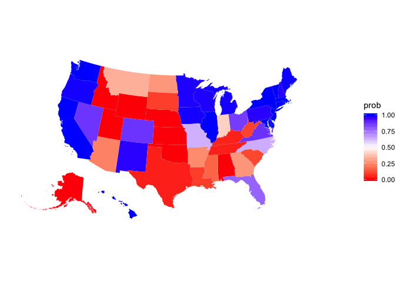<!-- -->

#### Final electoral college histogram

<!-- -->

#### National and state polls and the electoral college over time

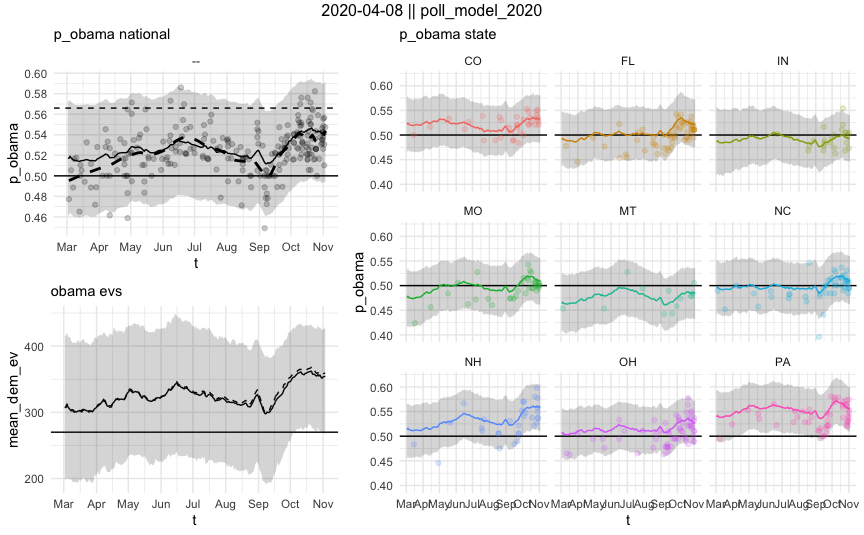<!-- -->

#### State vs national deltas over time

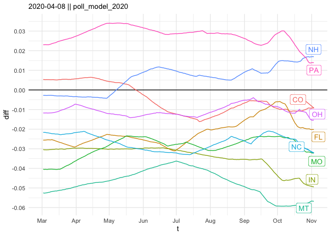<!-- -->

#### Model results vs polls vs the prior

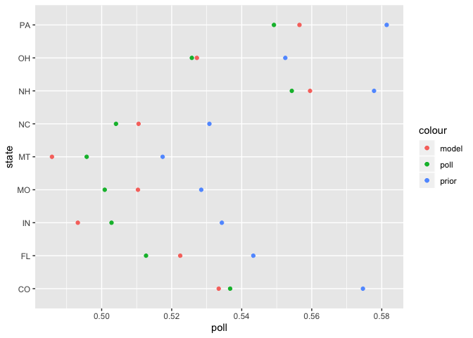<!-- -->

#### Performance

outlet                  ev_wtd_brier   unwtd_brier   states_correct
---------------------  -------------  ------------  ---------------
economist (backtest)       0.0286901     0.0286249               49

#### Predictions for each state

<!--html_preserve-->

<!--/html_preserve-->

### 2012 

#### Map

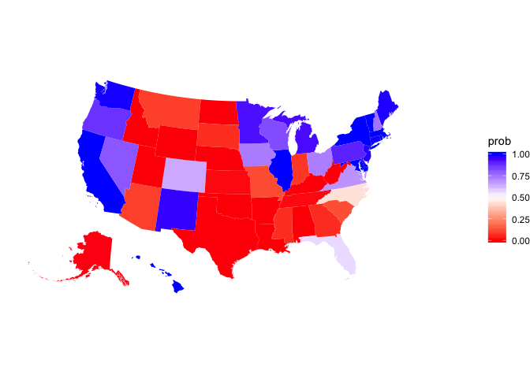<!-- -->

#### Final electoral college histogram

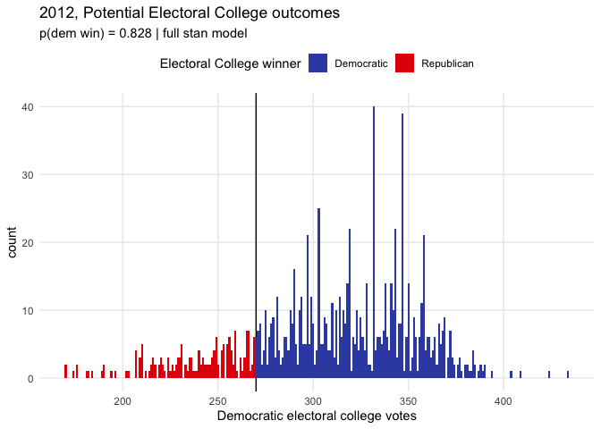<!-- -->

#### National and state polls and the electoral college over time

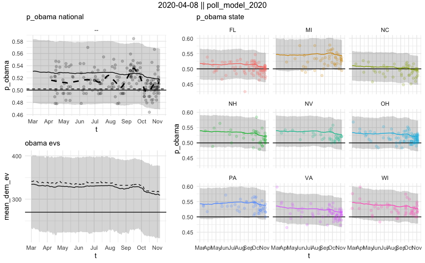<!-- -->

#### State vs national deltas over time

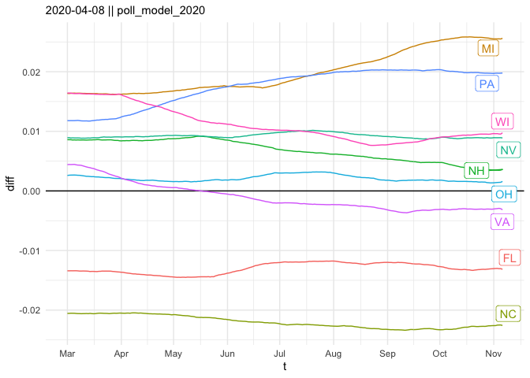<!-- -->

#### Model results vs polls vs the prior

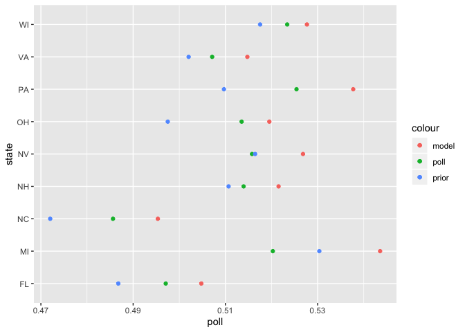<!-- -->

#### Performance

outlet                   ev_wtd_brier   unwtd_brier   states_correct
----------------------  -------------  ------------  ---------------
Linzer                             NA     0.0038000               NA
Wang/Ferguson                      NA     0.0076100               NA
Silver/538                         NA     0.0091100               NA
Jackman/Pollster                   NA     0.0097100               NA
Desart/Holbrook                    NA     0.0160500               NA
economist (backtest)        0.0267766     0.0193962               51
Intrade                            NA     0.0281200               NA
Enten/Margin of Error              NA     0.0507500               NA

#### Predictions for each state

<!--html_preserve-->

<!--/html_preserve-->

### 2016

#### Map

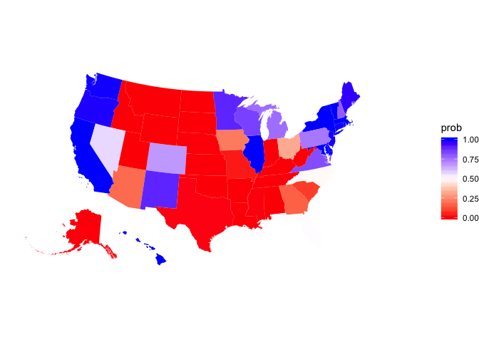<!-- -->

#### Final electoral college histogram

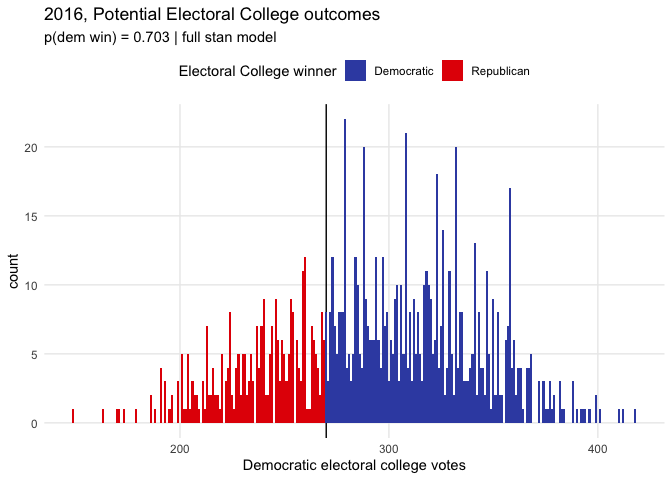<!-- -->

#### National and state polls and the electoral college over time

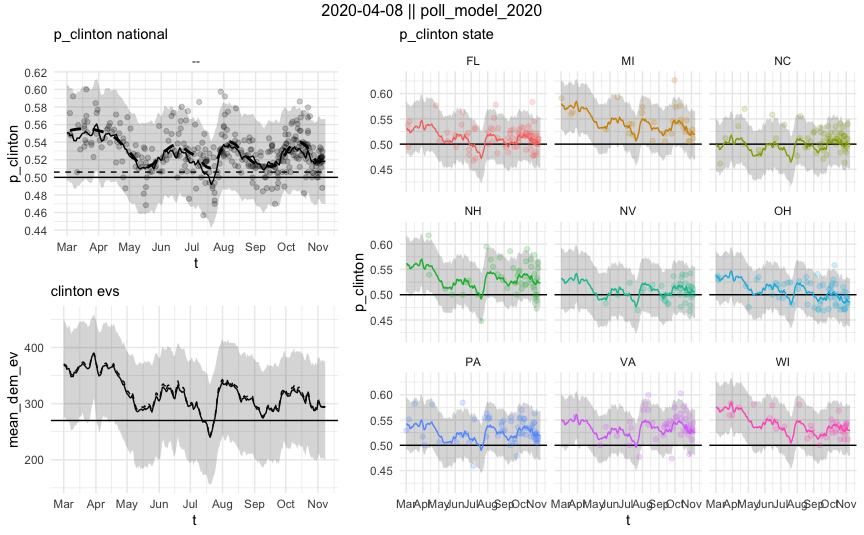<!-- -->

#### State vs national deltas over time

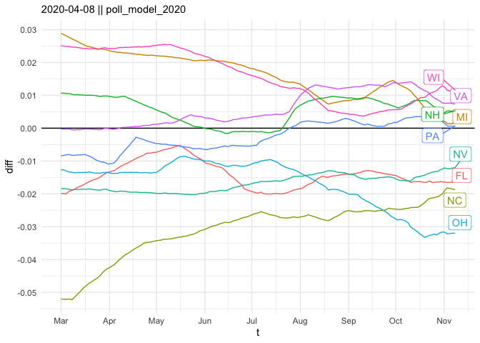<!-- -->

#### Model results vs polls vs the prior

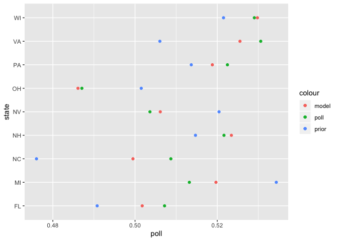<!-- -->

#### Performance

outlet                  ev_wtd_brier   unwtd_brier   states_correct
---------------------  -------------  ------------  ---------------
economist (backtest)       0.0817432     0.0575215               47
538 polls-plus             0.0928000     0.0664000               46
538 polls-only             0.0936000     0.0672000               46
princeton                  0.1169000     0.0744000               47
nyt upshot                 0.1208000     0.0801000               46
kremp/slate                0.1210000     0.0766000               46
pollsavvy                  0.1219000     0.0794000               46
predictwise markets        0.1272000     0.0767000               46
predictwise overall        0.1276000     0.0783000               46
desart and holbrook        0.1279000     0.0825000               44
daily kos                  0.1439000     0.0864000               46
huffpost                   0.1505000     0.0892000               46

#### Predictions for each state

<!--html_preserve-->

<!--/html_preserve-->

